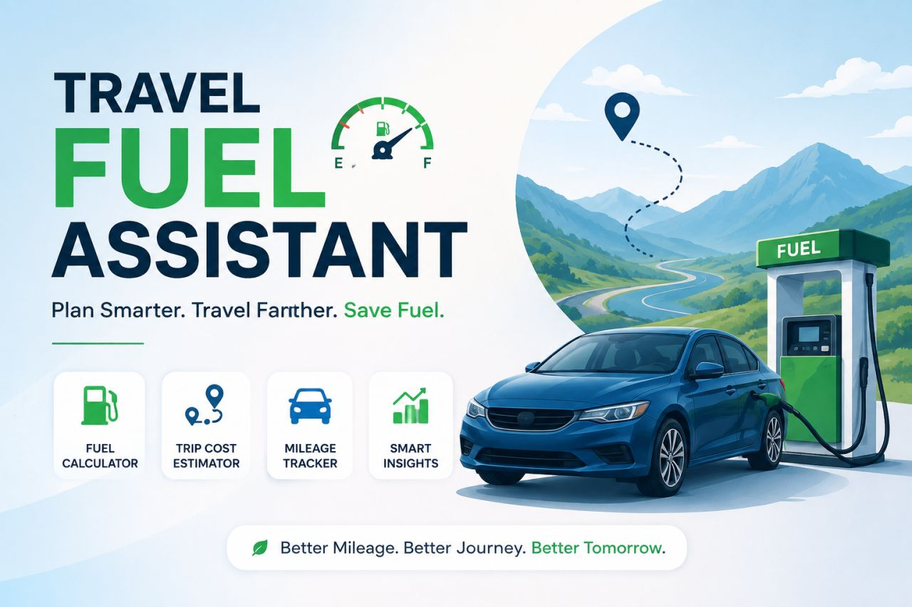

# 🚗 Travel Fuel Assistant

**Plan Smarter. Travel Farther. Save Fuel.**

A simple and efficient application designed to help users estimate fuel usage, calculate trip costs, and gain insights for better travel planning.

---

## 📸 Preview

<p align="center">
  
</p>

---

## ✨ Features

* ⛽ **Fuel Calculator**
  Calculate the amount of fuel required for your journey.

* 💰 **Trip Cost Estimator**
  Estimate total travel cost based on fuel price and distance.

* 🚘 **Mileage Tracker**
  Monitor and analyze your vehicle’s fuel efficiency.

* 📊 **Smart Insights**
  Get recommendations to improve mileage and reduce fuel consumption.

---

## 🚀 Getting Started

### Clone the Repository

```bash
git clone https://github.com/your-username/travel-fuel-assistant.git
cd travel-fuel-assistant
```

---

## 📁 Project Structure

```
travel-fuel-assistant/
│── README.md
│── img.png
│── src/
│── assets/
```

---

## 🛠️ Tech Stack

* HTML
* CSS
* JavaScript

*(Update this section if you're using frameworks like React, Node.js, etc.)*

---

## 📈 Future Enhancements

* 🔄 Real-time fuel price API integration
* 🗺️ Route optimization with maps
* 📱 Mobile-responsive UI improvements
* 📊 Advanced analytics dashboard

---

## 🤝 Contributing

Contributions are welcome!

1. Fork the repository
2. Create your feature branch
3. Commit your changes
4. Push to your branch
5. Open a pull request

---

## 📄 License

This project is licensed under the MIT License.

---

## 🌱 Tagline

> **Better Mileage. Better Journey. Better Tomorrow.**
